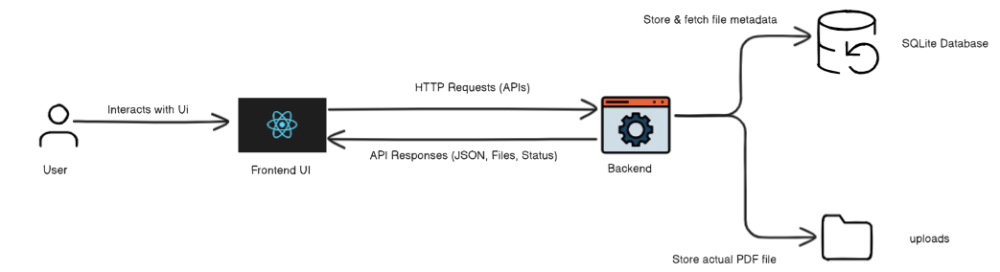

# Project Design Q&A

**Q1. What frontend framework did you use and why?**

I used React for the frontend.
I chose React because it is easy to learn and very popular for building user interfaces. Using components helps to keep the code organized. There is lots of online help and many libraries for React, which made development faster. I also used React Context to manage the app’s state simply.

**Q2. What backend framework did you choose and why?**

I used Express.js with Node.js for the backend.
I picked Express because it is simple to set up and lets you create APIs quickly. Express works well with JavaScript, which I already used in the frontend, so I didn’t have to learn another language. It is also beginner-friendly and there are many tutorials and resources for Express.

**Q3. What database did you choose and why?**

I chose SQLite as the database.
I picked SQLite since it is easy to use and doesn’t need any setup or a server. It stores data in a file, which is enough for small projects like this one. SQLite is free and works well for development and testing without extra configuration.

**Q4. If you were to support 1,000 users, what changes would you consider?**

To support 1,000 users, I would make a few changes:

- I would switch from SQLite to a bigger database like PostgreSQL or MySQL because they work better for many users at the same time.
- For file storage, instead of saving files in a local folder, I would use something like AWS S3 which is better for lots of uploads and downloads.
- I would make the backend scalable by running multiple server instances and using a load balancer.
- On the frontend, I would add pagination so loading a long list of documents is faster.

---

# 🧱 Architecture Overview



---

#  API Specification

## 1. Upload Document

- **URL:** `POST /documents/upload`
- **Method:** `POST`
- **Description:** Uploads a medical PDF file to the server and saves metadata to the database.

### Sample Request (Form-Data)
```
Key: file
Value: <your_file.pdf>
```

### Sample Response (JSON)
```json
{
  "message": "File uploaded successfully",
  "file": {
    "filename": "report.pdf",
    "path": "uploads/report.pdf",
    "size": 234567,
    "uploadedAt": "2025-08-06T10:30:00Z"
  }
}
```

---

## 2. Get All Documents

- **URL:** `GET /documents/`
- **Method:** `GET`
- **Description:** Returns a list of all uploaded documents from the database.

### Sample Response (JSON)
```json
[
  {
    "id": 1,
    "filename": "report.pdf",
    "size": 234567,
    "path": "uploads/report.pdf",
    "uploadedAt": "2025-08-06T10:30:00Z"
  },
  {
    "id": 2,
    "filename": "scan.pdf",
    "size": 187234,
    "path": "uploads/scan.pdf",
    "uploadedAt": "2025-08-05T16:12:00Z"
  }
]
```

---

## 3. Download Document

- **URL:** `GET /documents/:id`
- **Method:** `GET`
- **Description:** Downloads the specified document from the server.

### Sample Request
```
GET /documents/report.pdf
```

### Sample Response
- A file download (no JSON). The browser will download the PDF.

---

## 4. Delete Document

- **URL:** `DELETE /documents/:id `
- **Method:** `DELETE`
- **Description:** Deletes a document by ID. Removes it from the database and the `uploads/` folder.

### Sample Request
```
DELETE /documents/1
```

### Sample Response (JSON)
```json
{
  "message": "File deleted successfully"
}
```

#  4. Data Flow Description

##  Download a File

1. User clicks the **Download** button on the frontend.
2. React sends a `GET` request to:  
   `GET /documents/:id`
3. Express backend:
   - Looks for the file in the `uploads/` folder.
   - If found, streams the file back in the response.
4. Browser prompts user to **save** or **open** the PDF file.

---

##  Delete a File

1. User clicks the **Delete** button next to a document.
2. React sends a `DELETE` request to:  
   `DELETE /documents/:id `
3. Express backend:
   - Finds the file record in the SQLite DB using the ID.
   - Deletes the actual file from the `uploads/` folder.
   - Deletes the record from the database.
4. Sends back a success message:  
   `"File deleted successfully"`
5. React updates the UI by removing the file from the list.

---

#  5. Step-by-Step Process

##  When a File is Uploaded

1. User selects a PDF and clicks the **Upload** button.
2. React sends a `POST` request with the file to:  
   `POST /documents/upload`
3. Express backend uses **Multer** to:
   - Save the file in the `uploads/` folder.
   - Extract details like filename, path, and size.
4. Stores the file details into the **SQLite database**.
5. Sends a response:  
   `"File uploaded successfully"` + file metadata.
6. React updates the UI with the new file entry.

---

##  When a File is Downloaded

1. User clicks the **Download** button in the frontend.
2. React sends a `GET` request to:  
   `GET /documents/:id `
3. Backend:
   - Searches for the file in the `uploads/` folder.
   - Streams the file back to the browser.
4. User receives the file via download prompt in the browser.

---

##  5. Assumptions

1. **File Type & Size:**
   - Only **PDF files** are allowed for upload.
   - Maximum file size is assumed to be **5 MB** per document (this can be adjusted in Multer settings).

2. **Authentication:**
   - The current version **does not include authentication**.
   - It assumes only trusted users are accessing the app.

3. **Concurrency:**
   - The app is designed for **single-user or low traffic** environments.

4. **Storage:**
   - Uploaded files are stored in a local `uploads/` folder.
   - No cloud or distributed storage is used.

5. **Frontend-Backend Interaction:**
   - Assumes frontend will always send **properly formatted requests**.
   - No strict request validation or rate-limiting is applied.

6. **Error Handling:**
   - Basic error responses are included, but assumes users **won’t intentionally misuse** the app.


