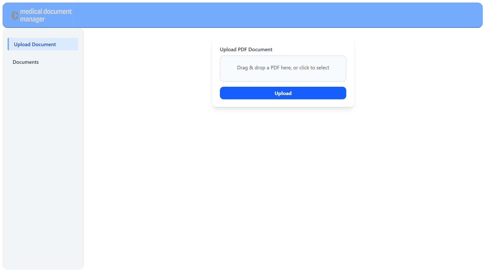
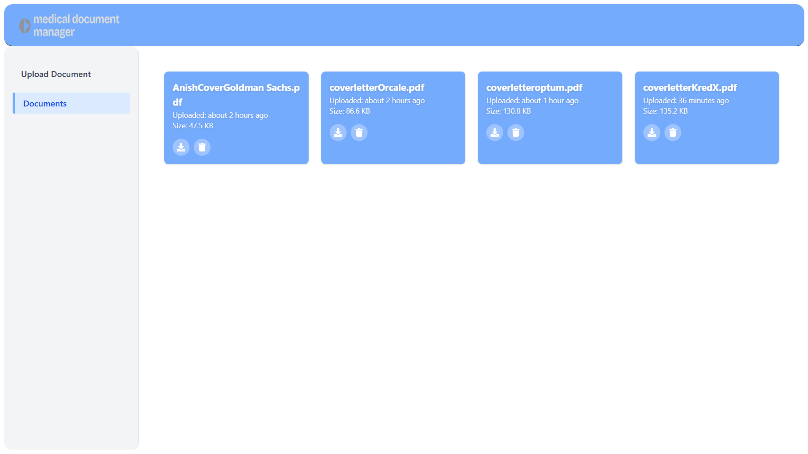

#  Medical Document Manager - Full Stack App

This project is a simple full-stack application that allows users to upload, view, download, and delete **medical PDF documents** like prescriptions or reports.

---

## UI Screenshots

### Upload Screen



### Documents List Screen



##  Project Overview

- **Frontend:** React (Vite)  
- **Backend:** Node.js with Express  
- **Database:** SQLite  
- **Storage:** Local `uploads/` folder  
- **Purpose:** Allow patients to manage medical PDFs easily via a clean UI and REST API.

---

##  How to Run It Locally

### 1. Clone the Repository
```bash
git clone <your-repo-url>
cd <project-folder>
```

### 2. Install Backend Dependencies
```bash
cd backend
npm install
```

### 3. Start Backend Server
```bash
node server.js
# Runs at http://localhost:3000
```

### 4. Start Frontend
```bash
cd ../frontend
npm install
npm run dev
```

---

##  Example API Calls

###  Upload a PDF File
```bash
curl -X POST http://localhost:3000/documents/upload
  -F "file=@/path/to/document.pdf"
```

###  List All Documents
```bash
curl http://localhost:3000/documents/
```

###  Download a Document
```bash
curl -O http://localhost:3000/documents/1
```

###  Delete a Document
```bash
curl -X DELETE http://localhost:3000/documents/1
```

---

##  Folder Structure
```
project-root/
│
├── frontend/      # React app (Vite)
├── backend/       # Express app
│   ├── uploads/           # PDF file storage
│   └── database.sqlite    # SQLite database file
├── README.md      # Project overview and setup
└── Design.md      # Architecture, API spec, and assumptions
```

---

##  Features

- Upload, list, download, and delete medical PDF documents.
- File metadata (filename, size, upload date) saved in SQLite.
- Simple, clean user interface for interaction.
